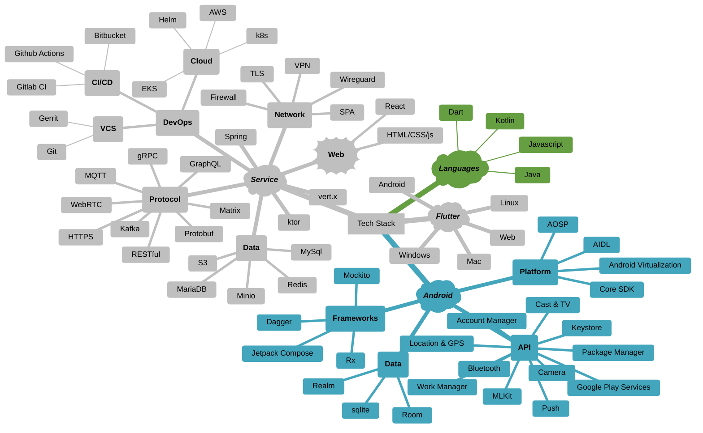

## Software Solutions Engineer
- Full Stack Mobile, Multi-platform, and Cloud Solution engineering
- Native Android App and Sdk development
- Cross-platform applications with Flutter and Dart
- Agile, Scrum, and team collaboration and leadership
- Application and Data Security, Business Continuity, and Disaster Recovery
- Administrative and Technical Network Security and Defense
- E2EE video-conferencing, VoIP & Chat
- Mixed Media, Entertainment, and Social Media
- Advertising, Fintech, and Enterprise Solutions

